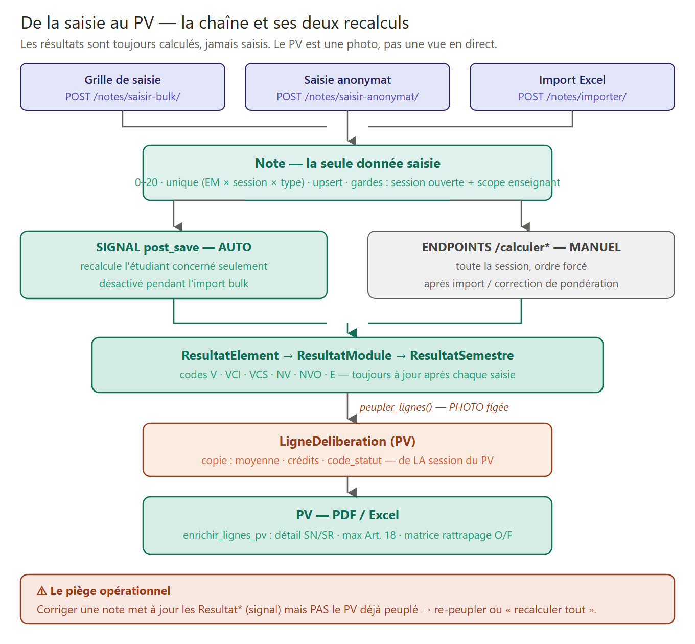
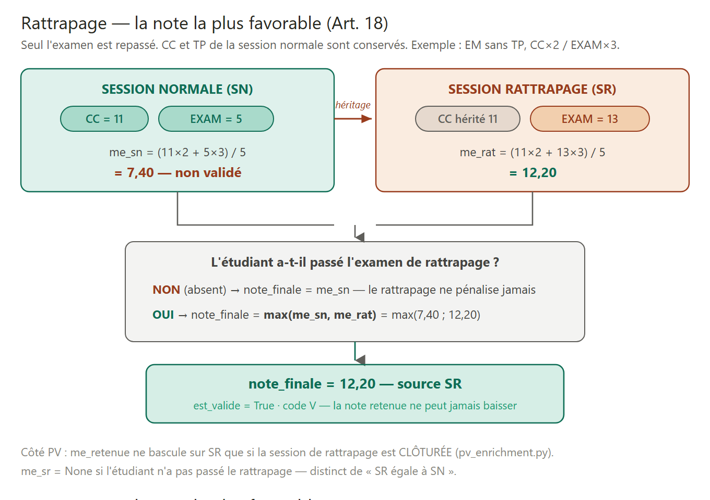

# Le calcul des notes dans SIGA — de la saisie au PV

> Document de référence vérifié ligne par ligne sur le code source (2026-06-11).
> Couvre toute la chaîne : saisie d'une note → recalcul automatique → moyennes
> EM/module/semestre → délibération → génération du PV.
>
> Voir aussi : [`inscription_processus_pedagogique.md`](inscription_processus_pedagogique.md)
> · Diagrammes : [`diagrams/`](diagrams/README.md).



---

## 0. La règle d'or

**Les résultats sont toujours calculés, jamais saisis.** La seule donnée entrée par
un humain est l'objet `Note` (CC, TP ou EXAM). Tout le reste — `ResultatElement`,
`ResultatModule`, `ResultatSemestre` — est produit par les services de calcul,
déclenchés soit automatiquement (signal), soit manuellement (endpoints).

Et le **PV est une photo** : `peupler_lignes()` copie les résultats au moment du
peuplement. Une correction de note ultérieure met à jour les `Resultat*` mais
**pas** le PV → il faut re-peupler ou « recalculer tout ».

---

## 1. Le modèle `Note` — la seule donnée saisie

`siga/apps/evaluations/models.py` (lignes 113-147) :

```python
class Note(models.Model):
    inscription_element = FK(InscriptionElement, on_delete=PROTECT)   # étudiant × EM
    session             = FK(SessionEvaluation,  on_delete=PROTECT)   # fenêtre de saisie
    type_note           = CharField(choices=[CC, TP, EXAM])
    valeur              = DecimalField(validators=[MinValueValidator(0), MaxValueValidator(20)])
    saisie_par          = FK(CustomUser)                               # traçabilité

    class Meta:
        unique_together = ('inscription_element', 'session', 'type_note')
```

Points clés :
- **Le grain** : 1 ligne = 1 composante. Un étudiant a jusqu'à 3 lignes `Note`
  par EM/session (CC, TP, EXAM) — pas 3 colonnes d'une même ligne.
- **Bornes 0-20** au niveau modèle (validators) + revérifiées dans les endpoints.
- **Pas de valeur nullable** : une note « absente » = absence de ligne, que le
  calcul interprète comme 0 (Stratégie A).
- **`unique_together`** → toute resaisie est un upsert (`update_or_create`).

`SessionEvaluation` (lignes 66-110) : 4 sessions max par an/institution —
`unique_together = (institution, annee_univ, type_session, type_semestre)` avec
`type_session ∈ {normale, rattrapage}` × `type_semestre ∈ {Impairs, Pairs}`.
Deux booléens indépendants : `est_ouverte` (saisie permise) et `est_close`
(verrou définitif, la clôture n'empêche pas calculs et PV).

---

## 2. La saisie — trois chemins, mêmes gardes

| Chemin | Page frontend | Endpoint backend |
|---|---|---|
| Grille manuelle | `app/dashboard/evaluations/notes/saisie/page.tsx` + `components/scolarite/NotesGrid.tsx` | `POST /notes/saisir-bulk/` |
| Par anonymat | `app/dashboard/evaluations/notes/saisie-anonymat/page.tsx` | `POST /notes/saisir-anonymat/` |
| Import Excel | `app/dashboard/evaluations/notes/importer/page.tsx` | `POST /notes/importer/` |

### `saisir-bulk` — `siga/apps/evaluations/views.py:727`

```python
if session.est_close:                                       # garde 1 : session verrouillée
    return Response({'detail': 'Session clôturée — saisie impossible.'}, status=400)

for em_id in em_ids:                                        # garde 2 : scope enseignant
    if not self._peut_acceder_em(request.user, em_id):
        return Response(..., status=403)

with transaction.atomic():                                  # tout ou rien
    for row in rows:
        for type_note, val_key in (('CC','cc'), ('TP','tp'), ('EXAM','exam')):
            raw = row.get(val_key)
            if raw is None or raw == '':
                continue                                    # vide = on ne touche pas
            valeur = Decimal(str(raw).replace(',', '.'))    # virgule → point
            if not (0 <= valeur <= 20):
                continue                                    # garde 3 : bornes
            Note.objects.update_or_create(                  # upsert, jamais de doublon
                inscription_element_id=ie_id, session=session, type_note=type_note,
                defaults={'valeur': valeur, 'saisie_par': request.user})
```

Comportements à connaître :
1. Une ligne de grille = jusqu'à 3 écritures (CC, TP, EXAM non vides).
2. **Cellule vide = note existante préservée** — permet de saisir CC, TP, EXAM
   séparément, par des personnes différentes.
3. `transaction.atomic()` : une erreur annule toute la grille.

### Le scope enseignant — `views.py:237`

```python
def _peut_acceder_em(user, em_id):
    if user.is_superuser or user.role == 'admin': return True
    if _has_access(user, 'eval_saisie', 'voir'):  return True   # scolarité / DE
    prof = getattr(user, 'prof_profile', None)
    return SuiviePointage.objects.filter(prof_id=prof.pk, em_id=em_id).exists()
```

Un enseignant ne peut lire/saisir **que les EMs qu'il enseigne effectivement**
(reliés par ses pointages). Anti-IDOR.

### Feuille de saisie : qui apparaît ? — `views.py:668`

- **Session normale** : tous les inscrits à l'EM **pour l'année de la session**
  (le filtre `annee_univ` évite de remonter les promotions précédentes).
- **Session rattrapage** : **uniquement** les étudiants ayant une
  `ObligationRattrapage` (obligatoire OU facultative) pour cet EM.
  → Pas de PV normal clôturé = pas d'obligations = feuille de rattrapage vide.

---

## 3. Le signal — recalcul automatique à chaque saisie

`siga/apps/evaluations/signals.py` :

```python
@receiver(post_save, sender='evaluations.Note')
def note_post_save(sender, instance, created, **kwargs):
    _recalcul_scope_note(instance)

def _recalcul_scope_note(note):
    if _signal_disabled(): return                 # désactivé pendant l'import bulk
    svc_notes = NoteCalculService(note.session)
    svc_notes.calculer_element(ie)                                       # 1. l'élément
    if em and em.module_lmd_id:
        ResultatModuleService(session).calculer(ie.inscription_ped, em.module_lmd)  # 2. son module
    svc_notes.calculer_semestre(ie.inscription_ped)                      # 3. son semestre
```

- **Chaque** `Note` sauvée/supprimée recalcule la cascade **pour cet étudiant
  seulement** — pas besoin de cliquer « calculer » après chaque saisie.
- **Import Excel** : le signal est désactivé pendant la boucle
  (`disable_recalcul_signal()`), puis un **recalcul global** de la session est
  lancé une seule fois — sinon 500 lignes = 500 recalculs du même semestre.
- Recalcul manuel de toute la session : `POST /sessions/{id}/calculer/` →
  `/calculer-modules/` → `/calculer-semestres/` (ordre forcé, refusé si close).

---

## 4. `calculer_element` — la note finale, normale et rattrapage

`siga/apps/evaluations/services/calcul_notes.py:33` — le helper **partagé**
(calcul officiel ET enrichissement PV → cohérence garantie par construction) :

```python
def _calculer_me_em(cc, tp, exam, has_tp, params):
    if has_tp:
        note = ((cc or 0)*coeff_cc + (exam or 0)*coeff_exam + (tp or 0)*coeff_tp) / 6
    else:
        note = ((cc or 0)*coeff_cc + (exam or 0)*coeff_exam) / 5
    return note.quantize(Decimal('0.01'), ROUND_HALF_UP)
```

- Pondérations institutionnelles (singleton `ParametresPonderation`) :
  **CC×2 / EXAM×3 / TP×1** par défaut.
- **Stratégie A** : composante absente = 0/20 (absent à l'épreuve).
- **Le diviseur s'adapte** : sans TP on divise par 5, pas par 6.

### Le rattrapage (Art. 18) — `calcul_notes.py:66`



```python
if self.session.type_session == 'rattrapage':
    exam_sr = notes_sr.get('EXAM')
    if exam_sr is None:
        note_finale = me_sn                        # absent au rattrapage → note normale gardée
    else:
        # CC et TP HÉRITÉS de la session normale, EXAM du rattrapage
        me_rat = _calculer_me_em(notes_sn['CC'], notes_sn['TP'], exam_sr, has_tp, params)
        note_finale = max(me_sn, me_rat)           # la plus favorable — Art. 18
```

Trois règles :
1. Au rattrapage, **seul l'examen est repassé** — CC/TP de la normale sont réutilisés.
2. Le `max` garantit qu'un rattrapage raté **ne fait jamais baisser** la note.
3. Absent au rattrapage (`exam_sr is None`) → la note normale est conservée telle quelle.

Verdict de l'élément (lignes 142-150) : `est_eliminatoire = note < seuil (déf. 6)` ;
`est_valide = note ≥ 10 et non éliminatoire`. Entre 6 et 10, le sort dépend du
module (compensation). Il existe **2 `ResultatElement`** par élément en cas de
rattrapage (un par session) — la consolidation choisit le bon plus haut.

---

## 5. Module et semestre — compensations et `est_admis`

(Détail complet : diagrammes [02](diagrams/02_cascade_resultats_validation.png) et
[03](diagrams/03_pipeline_calcul_notes_deliberation.png).)

### Module — `calcul_module.py:37`

`moyenne = Σ(note_EM × coeff) / Σ coeff` ; validé si ≥ 10 et aucun éliminatoire.
Codes provisoires posés sur chaque EM (`_assigner_codes_elements`, ligne 248) :

```python
if res.est_eliminatoire:              code = 'E'      # < 6 : rien ne le sauve
elif res.note_finale >= 10:           code = 'V'      # validé direct
elif resultat_module.est_valide:      code = 'VCI'    # compensé par le module (Art. 13)
else:                                  code = 'NV'     # provisoire → VCS possible
```

### Semestre — `calcul_notes.py:166`

MGS calculée **sur les EM** (même formule que le relevé officiel), puis :

```python
est_admis = (
    moyenne >= 10            # ① MGS ≥ 10
    and tous_modules_ok      # ② AUCUN module < 8
    and not a_eliminatoire   # ③ AUCUN éliminatoire (élément OU module)
)
```

> **Une bonne moyenne ne suffit pas** : un seul module < 8 ou un éliminatoire
> bloque le semestre, quelle que soit la MGS.

**Ordre crucial** (lignes 249-274) : `rafraichir_codes_apres_semestre()` est
appelé **avant** le comptage final des crédits — c'est lui qui transforme les
`NV` en `VCS` (module 8-10 + semestre admis, Art. 14). Les crédits sont ensuite
recomptés sur les `ResultatElement` rafraîchis : tout EM `est_valide` (V/VCI/VCS)
capitalise ses crédits, même dans un semestre non validé (capitalisation
modulaire LMD).

---

## 6. Le PV — peuplement, décisions, obligations

`siga/apps/evaluations/services/deliberation_semestre.py` — trois actions :

### `peupler_lignes()` (ligne 34) — la photo

```python
res_sem = ResultatSemestre.objects.filter(
    inscription_ped=insc_ped, session=self.pv.session,   # ← LA session du PV, pas la plus récente
).order_by('-id').first()

ligne, created = LigneDeliberation.objects.get_or_create(
    pv=self.pv, inscription_admin=...,
    defaults={'moyenne_annuelle': res_sem.moyenne, 'credits_annuels': ..., 'code_statut': ...})
if not created:
    ligne.moyenne_annuelle = moyenne; ...; ligne.save(...)   # re-peupler = mise à jour
```

- **Tous** les étudiants du semestre sont inclus (admis + ajournés) — le PV est exhaustif.
- Le filtre `session=self.pv.session` empêche un PV normal de récupérer par
  erreur les résultats du rattrapage.
- Les valeurs sont **recopiées** : le PV ne lit pas les `Resultat*` en direct.
  Re-peupler est idempotent et rafraîchit les lignes.

### `calculer_decisions()` (ligne 91)

`admis` si `ResultatSemestre.est_admis`, sinon `ajourned`. Les décisions
**`rachat`** posées manuellement par le jury ne sont **jamais écrasées**.

### `generer_obligations()` (ligne 154) — Art. 17

| Code EM | Contexte | Rattrapage |
|---|---|---|
| `E` | note < 6 | **obligatoire** (al. 1) |
| `NV` | module < 8 | **obligatoire** (al. 2) |
| `NV` | module 8-10 | **facultatif** (al. 3) |
| `V` / `VCI` / `VCS` | validé | aucun |

Ces obligations alimentent ensuite la feuille de saisie du rattrapage (§2).

Pour le PV **annuel** (`deliberation_annuelle.py`) : la décision se joue sur les
**crédits**, plus sur les notes — passage de droit (60 crédits), passage
conditionnel (≥ 65 % LP / 75 % ING), redoublement (1er échec), exclusion
(2e échec). Garde-fous : verrou L3/S5, année blanche (droit préservé, Art. 23),
blocage PFE < 12/20 pour les ingénieurs (Art. 16).

---

## 7. La génération du PDF — `pv_enrichment.py`

`siga/apps/evaluations/services/pv_enrichment.py` recompose, pour chaque
étudiant × EM, le détail SN/SR affiché dans le PV :

```python
me_sn = re_sn.note_finale                                   # lue (déjà calculée)
me_sr = _calculer_me_rattrapage(nts_sn, nts_sr, has_tp, p)  # recomposée (None si pas passé)

# Art. 18 côté affichage : SR retenue seulement si SR CLÔTURÉE et strictement meilleure
if sr and sr.est_close and me_sr is not None and (me_sn is None or me_sr > me_sn):
    me_retenue, source_retenue = me_sr, 'SR'
else:
    me_retenue, source_retenue = me_sn, 'SN'
```

- `_calculer_me_rattrapage` **réutilise `_calculer_me_em`** → le chiffre du PDF
  est mathématiquement identique à `ResultatElement.note_finale` en base.
- `me_sr = None` si l'étudiant n'a pas passé le rattrapage — distinct de
  « SR = SN ».
- Le code statut affiché vient du `ResultatElement` de la **session retenue**
  (SR clôturée prioritaire, car les codes VCI/VCS y ont été propagés).
- **Piège de convention** : `Semestre.type_semestre` stocke `'I'/'P'` mais
  `SessionEvaluation.type_semestre` stocke `'Impairs'/'Pairs'` — conversion
  obligatoire quand on relie les deux.

La vue `pdf` (`views.py:~1293`) assemble : lignes enrichies + matrice
d'obligations (O/F par étudiant × EM) + membres du jury + stats, rend le
template `pv_deliberation.html` et le convertit via **wkhtmltopdf** (paysage).

---

## 8. Récapitulatif des fichiers et endpoints

| # | Maillon | Fichier backend (`C:\react_projects\GES\siga\`) | Endpoint |
|---|---|---|---|
| 1 | Modèles Note/Session | `apps/evaluations/models.py:66-147` | — |
| 2 | Saisie bulk + gardes | `apps/evaluations/views.py:727` (garde :237, feuille :668) | `POST /notes/saisir-bulk/` |
| 3 | Signal recalcul auto | `apps/evaluations/signals.py` | — (post_save) |
| 4 | Note finale + rattrapage | `apps/evaluations/services/calcul_notes.py:33,66` | `POST /sessions/{id}/calculer/` |
| 5 | Module + codes V/VCI | `apps/evaluations/services/calcul_module.py:37,248` | `POST /sessions/{id}/calculer-modules/` |
| 6 | Semestre + est_admis + VCS | `apps/evaluations/services/calcul_notes.py:166` | `POST /sessions/{id}/calculer-semestres/` |
| 7 | Peuplement PV | `apps/evaluations/services/deliberation_semestre.py:34` | `POST /pvs/{id}/peupler/` |
| 8 | Décisions + obligations | `deliberation_semestre.py:91,154` / `deliberation_annuelle.py` | `/calculer-decisions/`, `/generer-obligations/` |
| 9 | Enrichissement + PDF | `apps/evaluations/services/pv_enrichment.py` + `views.py:~1293` | `GET /pvs/{id}/pdf/`, `/excel/` |

Côté frontend : API dans `lib/api/evaluations.ts`, hooks dans
`lib/api/evaluations-hooks.ts`, types dans `types/evaluations.ts`, pages sous
`app/dashboard/evaluations/`.

---

## 9. Checklist de vérification (les pièges prouvés par le code)

1. **PV pas à jour après correction ?** Normal — le PV est une photo. Re-peupler
   ou `recalculer-tout`. La saisie ne met à jour que les `Resultat*` (signal).
2. **Feuille de rattrapage vide ?** Le PV de la session normale n'a pas été
   clôturé/délibéré → aucune `ObligationRattrapage` générée.
3. **Étudiant à 13 de moyenne mais non admis ?** Vérifier les 3 conditions :
   un module < 8 ou un éliminatoire (< 6) bloque tout (Art. 15).
4. **Note de rattrapage plus basse que la normale ?** Sans effet : `max(SN, SR)`.
   Absent au rattrapage → note normale conservée.
5. **Crédits qui semblent manquer ?** `rafraichir_codes_apres_semestre` doit
   avoir tourné (VCS) — relancer `calculer-semestres` si les modules ont été
   recalculés après coup.
6. **Doublons dans la feuille de saisie ?** Le filtre `annee_univ=session.annee_univ`
   doit être présent — sans lui, les redoublants apparaissent deux fois.
7. **Un prof voit un 403 à la saisie ?** Il n'a pas de `SuiviePointage` sur cet
   EM — c'est le scope enseignant, pas un bug.
8. **PDF ≠ base ?** Impossible par construction : `pv_enrichment` réutilise
   `_calculer_me_em`. Si divergence apparente, le PV n'a pas été re-peuplé.
