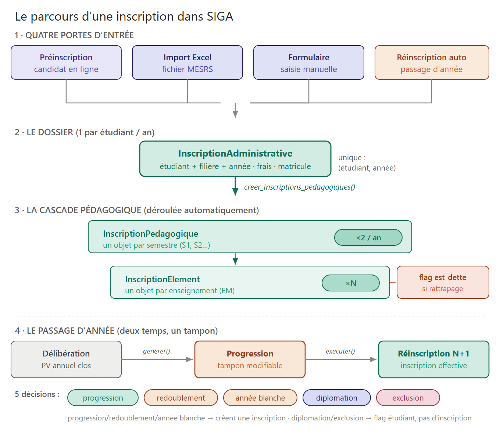
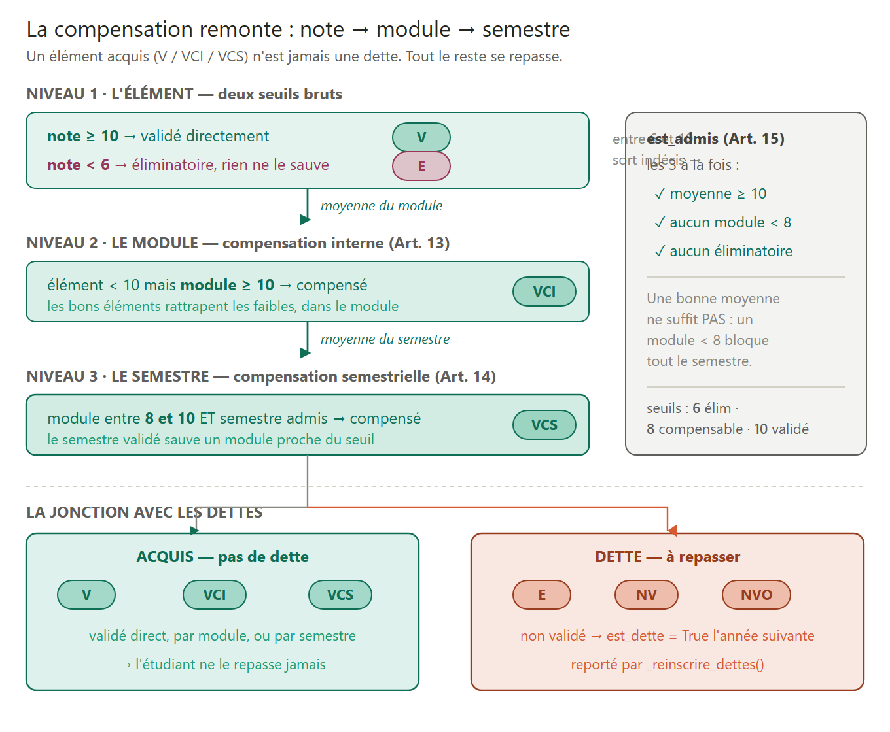
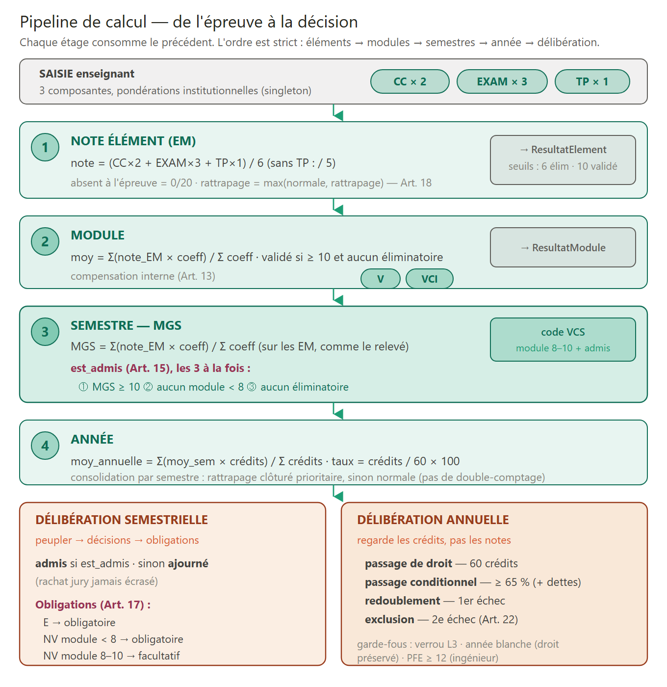

# Le processus d'inscription dans SIGA — vue pédagogique

> Document de synthèse à destination de l'équipe pédagogique et des nouveaux développeurs.
> Explique *comment* et *pourquoi* SIGA modélise l'inscription, en reliant chaque
> mécanisme au droit LMD mauritanien (Arrêté 562, Décret 2018-070).
>
> Voir aussi : [`inscription.md`](inscription.md), [`inscription_pedagogique.md`](inscription_pedagogique.md),
> [`inscription_progression.md`](inscription_progression.md).
>
> Diagrammes (SVG + PNG) : [`diagrams/`](diagrams/README.md).

---

## 1. L'idée centrale : deux inscriptions, pas une

« Inscrire un étudiant » se décompose en **deux actes distincts** :

| | **Inscription administrative** | **Inscription pédagogique** |
|---|---|---|
| Question | *A-t-il le droit d'être ici cette année ?* | *Quels enseignements suit-il et passe-t-il ?* |
| Granularité | 1 par étudiant **par année** | 1 par **semestre** (2 par an) |
| Porte sur | Étudiant ↔ Filière ↔ Année | Inscription admin ↔ Semestre ↔ Éléments |
| Gère | Frais, paiement, n° d'inscription, statut | Modules suivis, redoublement, **dettes d'UE** |

La hiérarchie complète est une chaîne à 4 niveaux :

```
InscriptionAdministrative   (étudiant + filière + année)
  └── InscriptionPedagogique   (un semestre : S1, S2…)
        └── InscriptionElement   (un enseignement précis = un EM)
              └── flag est_dette  (si rattrapage)
```

Contraintes d'unicité (backend `apps/inscriptions/models.py`) :

```python
InscriptionAdministrative : unique_together = ('etudiant', 'annee_univ')
InscriptionPedagogique    : unique_together = ('inscription_admin', 'semestre')
InscriptionElement        : unique_together = ('inscription_ped', 'element')
```



*De haut en bas : les quatre portes d'entrée, le dossier administratif, la cascade pédagogique automatique, puis le passage d'année.*

---

## 2. Quatre portes d'entrée, les mêmes objets en sortie

| Porte | Endpoint | Usage |
|---|---|---|
| **A · Pré-inscription** | `POST /preinscriptions/` puis `/convertir/` | candidat en ligne → étudiant |
| **B · Import Excel MESRS** | `POST /admin/importer-mers/` | rentrée de masse (~14 colonnes) |
| **C · Formulaire manuel** | `POST /admin/inscrire/` | saisie unitaire (wizard 3 étapes) |
| **D · Réinscription auto** | `ReinscriptionService.executer()` | passage d'année |

Quelle que soit la porte, on aboutit à une `InscriptionAdministrative` qui **déclenche
la même cascade** (§3).

### Le wizard frontend (porte C)

`app/dashboard/inscriptions/nouvelle/page.tsx` — un état unique calqué sur les colonnes
Excel, 3 étapes validées (Identité → Académique → Confirmation). Validation minimale :

```tsx
// Étape 0 : seuls NNI + nom_fr + genre sont requis
// Étape 1 : filiere + departement requis
// matricule vide → le backend génère ; moyenne accepte la virgule décimale
return inscriptionsAdminApi.inscrire(payload);   // un seul POST atomique
```

Conforme aux règles projet : `useMutation` + `invalidateQueries`, jamais d'`apiFetch` direct.

---

## 3. La cascade pédagogique (déroulée automatiquement)

`apps/inscriptions/utils.py : creer_inscriptions_pedagogiques()` déroule tout le programme
de l'étudiant dès la création de l'inscription admin :

```
Niveau (L1)
 ├─ Semestre S1  ──► InscriptionPedagogique
 │    └─ Module « Maths » ─ EM « Algèbre » ──► InscriptionElement
 └─ Semestre S2  ──► InscriptionPedagogique
      └─ …
```

Points de conception :

1. **Semestres génériques** — « S1 » est un objet unique partagé ; l'année et la filière
   sont portées par l'inscription admin.
2. **`get_or_create` partout** → idempotence (ré-imports Excel sans doublons).
3. **L'étudiant ne choisit rien** — le contrat pédagogique est *déduit* de filière + niveau
   (cursus fermés).

---

## 4. Le passage d'année : deux temps, un tampon

`apps/inscriptions/services/progression.py` + `reinscription.py`.

```
Délibération (PV clos) ──generer()──► Progression (tampon) ──executer()──► Inscription N+1
                                       statut=en_attente
                                       modifiable par l'admin
```

Pourquoi ce tampon ? Entre la délibération (juin) et la rentrée (octobre),
l'administration peut **ajuster** filière/niveau cibles sans toucher au PV figé.

### Les 5 décisions

| Décision | Niveau cible | Crée une inscription N+1 ? | Règle |
|---|---|---|---|
| `progression` | N+1 | ✅ + dettes éventuelles | passage normal |
| `redoublement` | N | ✅ dettes uniquement | **consomme** le droit (Art. 22) |
| `annee_blanche` | N | ✅ dettes uniquement | **ne consomme PAS** (Art. 23, médical) |
| `diplomation` | — | ❌ `statut='diplome'` | fin de cycle |
| `exclusion` | — | ❌ `statut='exclu'` | sortie définitive |

```python
# seul le redoublement consomme un droit (Art. 22 vs 23)
'consomme_droit_redoublement': (decision == 'redoublement'),
```

### Diplomation auto-détectée

```python
# decision = progression ET on est au dernier niveau → diplômé, pas N+1 fictif
if decision_mappee == 'progression' and niveau_source >= filiere_source.niveau_fin:
    return 'diplomation'
```

### Garde-fous

- Année cible **clôturée** → refus de génération.
- Progression déjà **exécutée** → refus de re-génération (protège l'historique).
- Modification de filière → vérifie que la nouvelle filière **couvre** le niveau visé.

---

## 5. Les dettes d'UE — le mécanisme le plus subtil

`reinscription.py : _reinscrire_dettes()`. En LMD, un étudiant peut **avancer en traînant**
des enseignements non validés : ce sont des dettes.

```python
# redoublant ? oui seulement si redoublement/année blanche.
# En 'progression' (passage conditionnel), l'étudiant AVANCE en traînant des dettes :
# il n'est PAS redoublant. est_dette reste True dans tous les cas.
est_redoublant = prog.decision in ('redoublement', 'annee_blanche')
```

**Distinction clé** :
- *Passe en L2 avec dettes de L1* = progresse, **pas** redoublant.
- *Refait sa L1* = redoublant.

**Clé d'unicité sur `em`** (jamais NULL), pas sur `element` (souvent NULL) — sinon tous
les EMs s'écraseraient sur `(inscription_ped, NULL)` et un seul survivrait.

L'orchestration distingue les deux cas :

```python
if prog.decision == 'progression':
    creer_inscriptions_pedagogiques(insc, ...)   # programme complet du NOUVEAU niveau
    _reinscrire_dettes(insc, prog)               # + dettes traînées
else:                                            # redoublement / année blanche
    _reinscrire_dettes(insc, prog)               # SEULEMENT les dettes
```

---

## 6. Comment une note devient un statut (V / VCI / VCS)

`apps/evaluations/services/`. La compensation **remonte** : note → module → semestre.
Trois seuils : **6** (éliminatoire) · **8** (compensable) · **10** (validé).

| Niveau | Code | Condition |
|---|---|---|
| Élément | `V` | note ≥ 10 (validé directement) |
| Élément | `E` | note < 6 (éliminatoire — rien ne le sauve) |
| Module | `VCI` | élément < 10 **mais** module ≥ 10 (compensation interne, Art. 13) |
| Semestre | `VCS` | module 8–10 **et** semestre admis (compensation semestrielle, Art. 14) |



Le pipeline complet de calcul — de la saisie d'une note jusqu'aux décisions de délibération (chaque étage consomme le précédent) :



### Le verdict du semestre (`est_admis`, Art. 15) — 3 conditions cumulatives

```python
est_admis = (
    moyenne >= Decimal('10')   # MGS ≥ 10
    and tous_modules_ok        # AUCUN module < 8
    and not a_eliminatoire     # AUCUN élément < 6
)
```

> Une bonne moyenne **ne suffit pas** : un module < 8 ou un éliminatoire bloque tout le semestre.

### La jonction avec les dettes

```python
# V / VCI / VCS traités à égalité : l'élément est acquis → pas de dette
element_valide = ie_old.resultats.filter(est_valide=True).exists() \
    or ie_old.resultats.filter(code_statut__in=['V', 'VCI', 'VCS']).exists()
```

Le code `VCS` peut être attribué **après** la délibération annuelle ; le second test
protège contre une dette à tort pour un élément compensé tardivement.

---

## 7. La naissance de l'étudiant : matricule + compte

`apps/inscriptions/views.py`.

### Matricule (`_generer_matricule`)

Format `{2 chiffres année}{code établissement}{séquence}` :

```python
matricule = f'{annee_bac}{code_inst}{seq:0{seq_width}d}'   # ex 255001
while Etudiant.objects.filter(matricule=matricule).exists():  # anti-collision
    seq += 1; matricule = ...
```

- Deux formats : `historic5` (5 chiffres, anciennes promos) / `current6` (rentrées actuelles).
- Séquence **scopée par institution** (isolation multi-institution).

### Compte automatique (`_creer_compte_etudiant`)

```python
User.objects.create_user(
    username = cni,    # NNI — l'étudiant le connaît
    password = nbac,   # numéro de bac — idem
    role = 'etudiant',
    doit_changer_mdp = True,   # changement forcé à la 1re connexion
)
```

Idempotent ; rattache un compte préexistant au même NNI (utile aux ré-imports).

---

## 8. Vue d'ensemble — les deux cascades

```
INSCRIPTION (descendante)              RÉSULTATS (ascendante)
  Admin                                  est_admis  (semestre)
   └ Pédagogique (semestre)        ▲        ▲ VCS — compensation semestre
      └ Élément (EM)               │        │ VCI — compensation module
         └ dette ?  ───────────────┘        └ V — validé direct / E,NV — dette
```

Les inscriptions **déroulent** le programme (haut → bas). Les résultats **remontent**
la validation (bas → haut). Le point de jonction — `est_valide` / `code_statut` — décide,
à la frontière entre deux années, ce que l'étudiant emporte comme dettes.

SIGA n'est pas un registre : c'est une **machine réglementaire** qui applique l'Arrêté 562
de bout en bout.

---

## Fichiers de référence

| Couche | Fichier |
|---|---|
| Modèles | `apps/inscriptions/models.py` |
| Cascade pédagogique | `apps/inscriptions/utils.py` |
| Progression / passage | `apps/inscriptions/services/progression.py` |
| Réinscription / dettes | `apps/inscriptions/services/reinscription.py` |
| Calcul des résultats | `apps/evaluations/services/calcul_notes.py`, `calcul_module.py` |
| Délibération | `apps/evaluations/services/deliberation_semestre.py`, `deliberation_annuelle.py` |
| Matricule + compte | `apps/inscriptions/views.py` |
| Wizard frontend | `app/dashboard/inscriptions/nouvelle/page.tsx` |
| API + hooks | `lib/api/inscriptions.ts`, `lib/api/inscriptions-hooks.ts` |
